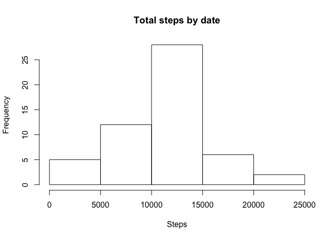
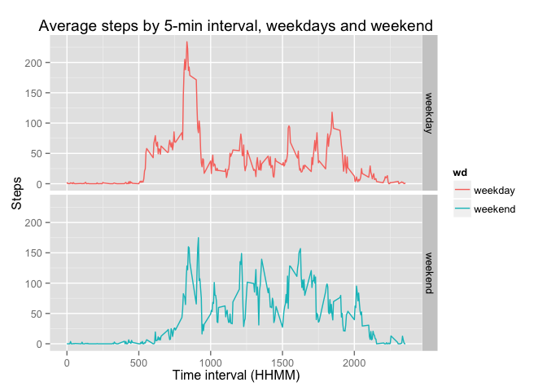

# Reproducible Research: Peer Assessment 1

The following is an analysis of a set of data containing the number of steps taken by an anonymous individual during 5-minute intervals during the months of October and November, 2012. 

The analysis requires two libraries, commonly used in R:

```r
library(dplyr)
```

```
## 
## Attaching package: 'dplyr'
## 
## The following objects are masked from 'package:stats':
## 
##     filter, lag
## 
## The following objects are masked from 'package:base':
## 
##     intersect, setdiff, setequal, union
```

```r
library(ggplot2)
```


## Loading and preprocessing the data

The dataset itself is contained in a comma-separated file included in the assignment packet.  It is read into a data.frame named 'activityset,' which serves as the base set of data throughout this analysis.

```r
activityset <- read.csv("activity.csv", stringsAsFactors = FALSE, header = TRUE)
```
The activityset data contains 17568 rows in 3 columns:

```r
colnames(activityset)
```

```
## [1] "steps"    "date"     "interval"
```

The 'Date' column is, when imported, of class character, so must be changed to a POSIX data for further analysis:


```r
activityset[,2] <- as.Date(activityset[,2], format="%Y-%m-%d")
```

## What is mean total number of steps taken per day?

The total number of steps taken per day can be calculated aggregating rows on the POSIX-date 'date' column, and calling 'sum' on the result. The column 'x' in the following represents the total number of steps per day:


```r
aggregate(activityset$steps, by=list(mydate=activityset$date), FUN=sum)
```

```
##        mydate     x
## 1  2012-10-01    NA
## 2  2012-10-02   126
## 3  2012-10-03 11352
## 4  2012-10-04 12116
## 5  2012-10-05 13294
## 6  2012-10-06 15420
## 7  2012-10-07 11015
## 8  2012-10-08    NA
## 9  2012-10-09 12811
## 10 2012-10-10  9900
## 11 2012-10-11 10304
## 12 2012-10-12 17382
## 13 2012-10-13 12426
## 14 2012-10-14 15098
## 15 2012-10-15 10139
## 16 2012-10-16 15084
## 17 2012-10-17 13452
## 18 2012-10-18 10056
## 19 2012-10-19 11829
## 20 2012-10-20 10395
## 21 2012-10-21  8821
## 22 2012-10-22 13460
## 23 2012-10-23  8918
## 24 2012-10-24  8355
## 25 2012-10-25  2492
## 26 2012-10-26  6778
## 27 2012-10-27 10119
## 28 2012-10-28 11458
## 29 2012-10-29  5018
## 30 2012-10-30  9819
## 31 2012-10-31 15414
## 32 2012-11-01    NA
## 33 2012-11-02 10600
## 34 2012-11-03 10571
## 35 2012-11-04    NA
## 36 2012-11-05 10439
## 37 2012-11-06  8334
## 38 2012-11-07 12883
## 39 2012-11-08  3219
## 40 2012-11-09    NA
## 41 2012-11-10    NA
## 42 2012-11-11 12608
## 43 2012-11-12 10765
## 44 2012-11-13  7336
## 45 2012-11-14    NA
## 46 2012-11-15    41
## 47 2012-11-16  5441
## 48 2012-11-17 14339
## 49 2012-11-18 15110
## 50 2012-11-19  8841
## 51 2012-11-20  4472
## 52 2012-11-21 12787
## 53 2012-11-22 20427
## 54 2012-11-23 21194
## 55 2012-11-24 14478
## 56 2012-11-25 11834
## 57 2012-11-26 11162
## 58 2012-11-27 13646
## 59 2012-11-28 10183
## 60 2012-11-29  7047
## 61 2012-11-30    NA
```

These results show that this user takes between 10,000 and 15,000 steps on majority of days during this two-month period, as shown in the following histogram:

```r
aggregate(activityset$steps, by=list(mydate=activityset$date), FUN=sum) -> forhist
hist(forhist$x, xlab="Steps", main="Total steps by date")
```

 

Not suprisingly, the mean number of steps per day is 1.0766189\times 10^{4} with a median of 10765.

## What is the average daily activity pattern?

The dataset contains steps per 5-minute interval throughout the day, which is represented in an integer ranging from 0 to 2355.  These correspond to hours and minutes from midnight to 11:59PM each day. We therefore can chart the average activity of this individual throughout the day.

This analysis is completed by aggregating the 'activityset' dataset, like previously, but this time on the time interval variable 'interval' and averaging the steps:

```r
aggregate(activityset$steps, by=list(interval=activityset$interval), FUN=mean, na.rm = TRUE) -> fortimeseries
ggplot(fortimeseries, aes(x=interval, y=x)) + geom_line() -> p
p <- p + ylab("Steps") + xlab("Time interval (HHMM)") + ggtitle("Average steps by 5-min interval")
print(p)
```

 

The 5-minute interval which, on average, sees the most number of steps is:

```r
which.max(fortimeseries$x) -> rownum
fortimeseries[rownum, 1]
```

```
## [1] 835
```
or 8:35AM, suggesting that this user has a long walk between his or her parking spot and his or her office!

## Inputing missing values

There are 2304 missing values in the 'steps' column of the dataset.  

We can fill in those missing values by substituting taking the average number of steps for the same interval in the other days of the dataset, and replacing the 'na' values.

We accomplish this in two steps. First, we subset 'activityset' into two: 

```r
activityset[is.na(activityset), ] -> naset
activityset[complete.cases(activityset), ] -> nonaset
```
1. 'naset', which contains all the rows with 'NA' in the 'steps' column
2. 'nonaset', which contains all the rows without 'NA' in the 'steps' column

These two sets should contain the total set of rows in the original activity set, and checking on 'nrow' shows that they do: Number of rows in 'naset' 2304 + 15264 = 17568.

As we have already calculated the average number of steps without NAs in the creating the previous chart, we can reuse the aggregated dataset created to fill in the missing values in 'naset'.

```r
merge(naset, fortimeseries, by="interval") -> withavg
withavg[, c(1,3,4)]  -> withavg
colnames(withavg) <- c("interval", "date", "steps")
```

These two sets can then be merged back together:

```r
rbind(nonaset, withavg) -> completeSet
```
The resultant set has 17568 rows and 3 cols, that are named steps, date, interval, just like 'activityset'.  And there are 0 NAs in the dataset.

In order to see if this strategy of substituting for missing data was successful, we will conduct the same analyses as above.  The histogram of the completeSet dataset looks remarkably similar to that of the activity set:

```r
aggregate(completeSet$steps, by=list(mydate=completeSet$date), FUN=sum) -> forhist2
hist(forhist2$x, xlab="Steps", main="Total steps by date")
```

 

Not suprisingly, the mean number of steps per day is 1.0766189\times 10^{4} with a median of 10765.

```r
mean(forhist2$x, na.rm = TRUE)
```

```
## [1] 10766.19
```

```r
median(forhist2$x, na.rm = TRUE)
```

```
## [1] 10766.19
```

The mean before the values were replace was 1.07662\times 10^{4}. This compares with 1.07662\times 10^{4} after substitution.  A similar pattern was found with the median, with 1.0765\times 10^{4} before substitution and 1.07662\times 10^{4} after. 

Therefore, there was neglible impact on the dataset as a whole by replacing the missing values.


## Are there differences in activity patterns between weekdays and weekends?

As suggested above, the dataset may show a pattern of behavior related to the user's work schedule (i.e. the maximum number of steps on average occur at 8:35AM). To investigate this futher, we recode the 'date' variable into a factor by 'weekday' or 'weekend'.

```r
weekdays(activityset$date) -> activityset$wd
factor(activityset$wd) -> activityset$wd
levels(activityset$wd) <- c("weekday", "weekday", "weekend", "weekend", "weekday", "weekday", "weekday")
```

As above, we need to aggregate by interval for each of these factors. While there is almost certainly a more elegant way of accomplishing this, the simpliest startegy is to subset the activity set into two:

```r
activityset[activityset$wd == "weekday", ] -> myweekdays
activityset[activityset$wd == "weekend", ] -> myweekends
```

Aggregate by interval with 'mean' as the function for each of the resultant datasets: 

```r
aggregate(myweekdays$steps, by=list(interval=myweekdays$interval), FUN=mean, na.rm = TRUE) -> fortimeseries1
aggregate(myweekends$steps, by=list(interval=myweekends$interval), FUN=mean, na.rm = TRUE) -> fortimeseries2
```

The first resultant dataset contains 288 rows and 2 cols, with column names: interval, x. The second contains 288 rows and 2 cols, with column names: interval, x.  The subsetting was successful. The two can be put together with rbind to represent the original whole before subsetting.

However, before we do that, we need to maintain the information about which subset represents which factor. Thus, we add a variable to each, to hold which factor the values represent. 

```r
fortimeseries1$wd <- "weekday"
fortimeseries2$wd <- "weekend"
rbind(fortimeseries1, fortimeseries2) -> fortimeseries3
```

The final resultant dataset, ready for plotting, contains 576 rows and 3 cols, with column names: interval, x, wd.

```r
ggplot(fortimeseries3, aes(x=interval, y=x, colour=wd, group=wd)) + geom_line() -> p
p <-  p + facet_grid(wd ~ .) + ylab("Steps") + xlab("Time interval (HHMM)")
p <- p + ggtitle("Average steps by 5-min interval, weekdays and weekend")
 print(p)
```

 
