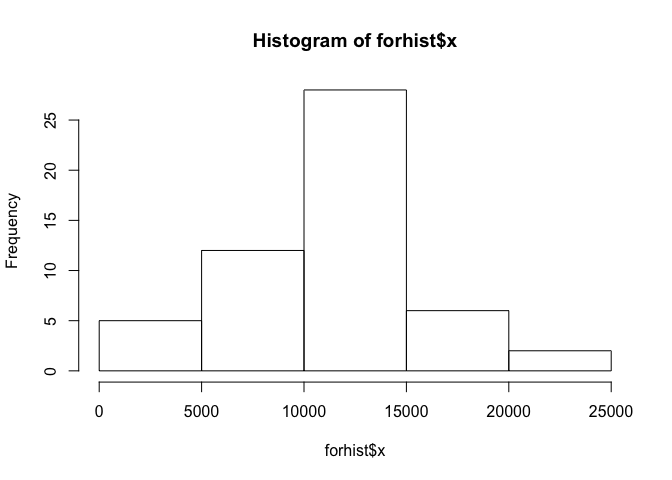
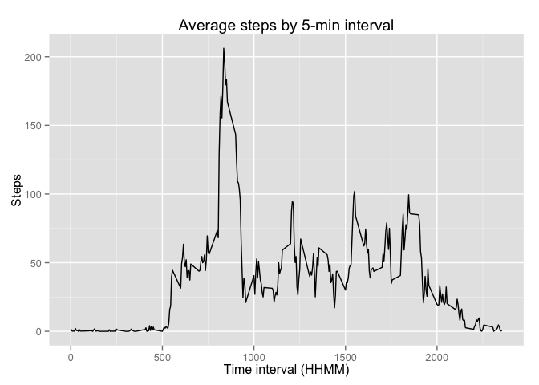
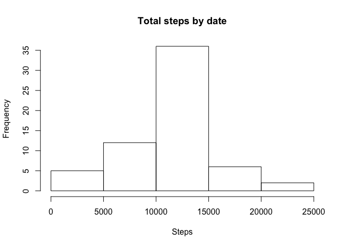
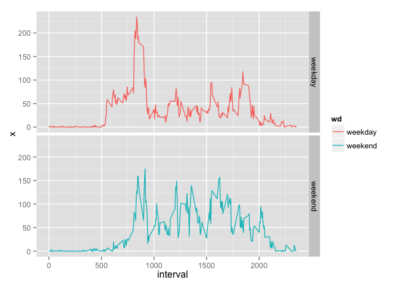

# Reproducible Research: Peer Assessment 1

```r
library(dplyr)
```

```
## 
## Attaching package: 'dplyr'
## 
## The following objects are masked from 'package:stats':
## 
##     filter, lag
## 
## The following objects are masked from 'package:base':
## 
##     intersect, setdiff, setequal, union
```

```r
library(ggplot2)
```

## Loading and preprocessing the data

Load the data (i.e. read.csv())

```r
activityset <- read.csv("activity.csv", stringsAsFactors = FALSE, header = TRUE)
```

Change 'date' column to posix date format


```r
activityset[,2] <- as.Date(activityset[,2], format="%Y-%m-%d")
```

## What is mean total number of steps taken per day?

For this part of the assignment, you can ignore the missing values in the dataset.

Calculate the total number of steps taken per day

```r
aggregate(activityset$steps, by=list(mydate=activityset$date), FUN=sum)
```

```
##        mydate     x
## 1  2012-10-01    NA
## 2  2012-10-02   126
## 3  2012-10-03 11352
## 4  2012-10-04 12116
## 5  2012-10-05 13294
## 6  2012-10-06 15420
## 7  2012-10-07 11015
## 8  2012-10-08    NA
## 9  2012-10-09 12811
## 10 2012-10-10  9900
## 11 2012-10-11 10304
## 12 2012-10-12 17382
## 13 2012-10-13 12426
## 14 2012-10-14 15098
## 15 2012-10-15 10139
## 16 2012-10-16 15084
## 17 2012-10-17 13452
## 18 2012-10-18 10056
## 19 2012-10-19 11829
## 20 2012-10-20 10395
## 21 2012-10-21  8821
## 22 2012-10-22 13460
## 23 2012-10-23  8918
## 24 2012-10-24  8355
## 25 2012-10-25  2492
## 26 2012-10-26  6778
## 27 2012-10-27 10119
## 28 2012-10-28 11458
## 29 2012-10-29  5018
## 30 2012-10-30  9819
## 31 2012-10-31 15414
## 32 2012-11-01    NA
## 33 2012-11-02 10600
## 34 2012-11-03 10571
## 35 2012-11-04    NA
## 36 2012-11-05 10439
## 37 2012-11-06  8334
## 38 2012-11-07 12883
## 39 2012-11-08  3219
## 40 2012-11-09    NA
## 41 2012-11-10    NA
## 42 2012-11-11 12608
## 43 2012-11-12 10765
## 44 2012-11-13  7336
## 45 2012-11-14    NA
## 46 2012-11-15    41
## 47 2012-11-16  5441
## 48 2012-11-17 14339
## 49 2012-11-18 15110
## 50 2012-11-19  8841
## 51 2012-11-20  4472
## 52 2012-11-21 12787
## 53 2012-11-22 20427
## 54 2012-11-23 21194
## 55 2012-11-24 14478
## 56 2012-11-25 11834
## 57 2012-11-26 11162
## 58 2012-11-27 13646
## 59 2012-11-28 10183
## 60 2012-11-29  7047
## 61 2012-11-30    NA
```

If you do not understand the difference between a histogram and a barplot, research the difference between them. Make a histogram of the total number of steps taken each day

```r
aggregate(activityset$steps, by=list(mydate=activityset$date), FUN=sum) -> forhist
hist(forhist$x)
```

 

Calculate and report the mean and median of the total number of steps taken per day

```r
mean(forhist$x, na.rm = TRUE)
```

```
## [1] 10766.19
```

```r
median(forhist$x, na.rm = TRUE)
```

```
## [1] 10765
```

## What is the average daily activity pattern?

Make a time series plot (i.e. type = "l") of the 5-minute interval (x-axis) and the average number of steps taken, averaged across all days (y-axis)

```r
aggregate(activityset$steps, by=list(interval=activityset$interval), FUN=mean, na.rm = TRUE) -> fortimeseries
ggplot(fortimeseries, aes(x=interval, y=x)) + geom_line() -> p
print(p)
```

 
Which 5-minute interval, on average across all the days in the dataset, contains the maximum number of steps?

```r
which.max(fortimeseries$x) -> rownum
fortimeseries[rownum, 1]
```

```
## [1] 835
```
## Inputing missing values

Note that there are a number of days/intervals where there are missing values (coded as NA). The presence of missing days may introduce bias into some calculations or summaries of the data.

Calculate and report the total number of missing values in the dataset (i.e. the total number of rows with NAs)

```r
nasteps <- sum(is.na(activityset))
```

Devise a strategy for filling in all of the missing values in the dataset. The strategy does not need to be sophisticated. For example, you could use the mean/median for that day, or the mean for that 5-minute interval, etc.

```r
activityset[is.na(activityset), ] -> naset
merge(naset, fortimeseries, by="interval") -> withavg
withavg[, c(1,3,4)]  -> withavg
colnames(withavg) <- c("interval", "date", "steps")
# Now, subset the original to contain only complete cases (i.e. those not in 'naset')
activityset[complete.cases(activityset), ] -> nonaset
# and merge back together
```

Create a new dataset that is equal to the original dataset but with the missing data filled in.

```r
rbind(nonaset, withavg) -> completeSet
```

Make a histogram of the total number of steps taken each day  

```r
aggregate(completeSet$steps, by=list(mydate=completeSet$date), FUN=sum) -> forhist2
hist(forhist2$x)
```

 

and Calculate and report the mean and median total number of steps taken per day.

```r
mean(forhist2$x, na.rm = TRUE)
```

```
## [1] 10766.19
```

```r
median(forhist2$x, na.rm = TRUE)
```

```
## [1] 10766.19
```
Do these values differ from the estimates from the first part of the assignment?

>The mean before the values were replace was 1.07662\times 10^{4}. This compares with 1.07662\times 10^{4} after substitution.  A similar pattern was found with the median, with 1.0765\times 10^{4} before substitution and 1.07662\times 10^{4} after.

What is the impact of imputing missing data on the estimates of the total daily number of steps?

> The impact of substituting the average for that time slot from the other days recorded was minimal on the overall dataset.

## Are there differences in activity patterns between weekdays and weekends?

For this part the weekdays() function may be of some help here. Use the dataset with the filled-in missing values for this part.

Create a new factor variable in the dataset with two levels – “weekday” and “weekend” indicating whether a given date is a weekday or weekend day.

Make a panel plot containing a time series plot (i.e. type = "l") of the 5-minute interval (x-axis) and the average number of steps taken, averaged across all weekday days or weekend days (y-axis). See the README file in the GitHub repository to see an example of what this plot should look like using simulated data.

```r
weekdays(activityset$date) -> activityset$wd
factor(activityset$wd) -> activityset$wd
levels(activityset$wd) <- c("weekday", "weekday", "weekend", "weekend", "weekday", "weekday", "weekday")
activityset[activityset$wd == "weekday", ] -> myweekdays
activityset[activityset$wd == "weekend", ] -> myweekends
aggregate(myweekdays$steps, by=list(interval=myweekdays$interval), FUN=mean, na.rm = TRUE) -> fortimeseries1
aggregate(myweekends$steps, by=list(interval=myweekends$interval), FUN=mean, na.rm = TRUE) -> fortimeseries2
fortimeseries1$wd <- "weekday"
fortimeseries2$wd <- "weekend"
rbind(fortimeseries1, fortimeseries2) -> fortimeseries3
ggplot(fortimeseries3, aes(x=interval, y=x, colour=wd, group=wd)) + geom_line() -> p
p <-  p + facet_grid(wd ~ .)
 print(p)
```

 
